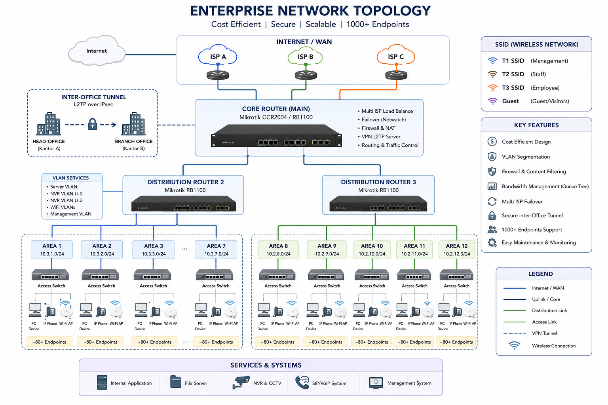

# Enterprise Multi-Site Network Architecture & ISMS Hardening Blueprint

## 📌 Executive & Architectural Overview
This repository showcases a production-grade, highly resilient, and compliant enterprise network infrastructure blueprint designed to support **1,000+ endpoint nodes** across multi-floor environments and decentralized regional sites. 

The core engineering objectives achieved in this architecture are:
* **Zero MPLS Dependency:** Replaced expensive traditional links with resilient site-to-site tunneling, reducing WAN operational expenditure significantly.
* **Strict Lateral Isolation:** Implemented layer-2/layer-3 network segmentation across **12 localized enterprise zones** to enforce a zero-trust model and contain security breaches.
* **ISO 27001 ISMS Alignment:** Embedded formal asset controls, role-based access matrices, and systematic technical change-management trails directly into the infrastructure topology.

---

## 🛠️ Core Engineering & Security Highlights

### 1. High Availability & Automated WAN Failover
To eliminate single points of failure (SPOF) and secure critical operations, the core routing engine implements an automated network monitoring system using MikroTik RouterOS Netwatch.
* **Mechanisms:** Continuous heartbeat polling to public DNS infrastructures at a strict 1-minute interval.
* **Execution:** Immediate, automated dynamic routing switchover to secondary ISP pathways upon fault detection, maintaining session persistence for mission-critical applications.
* **Script Implementation:** *Proactive script automations can be found in the `/scripts` directory.*

### 2. Micro-Segmentation & VLAN Access Controls
Lateral movement is mitigated by breaking down the multi-floor deployment into isolated administrative domains. Traffic between zones is restricted using Cisco Catalyst Access Control Lists (ACLs) and stateful state tracking.

| SSID / VLAN Domain | Target Audience | Network Access Policy | Security Profile |
| :--- | :--- | :--- | :--- |
| **Management** | IT Engineering & DevOps | Full Core Access (SSH/HTTPS) | MFA Required, Strict Logging |
| **Staff** | Permanent Internal Corporate | Local Servers & Trusted ERP Ports | Active Directory Bound |
| **Employee** | Contractors / General Staff | External Web Access (HTTP/S) Only | Layer-2 Isolation Enabled |
| **Guest** | Visitors / Untrusted Devices | Throttled Internet Gateway | Complete Subnet Sandboxing |

### 3. Asymmetric Multi-Site Tunneling (L2TP/IPSec)
Instead of relying on rigid, high-cost leased circuits, distributed branch offices are interconnected seamlessly using hardened Layer 2 Tunneling Protocol (L2TP) over IPSec.
* Enforces AES-256 cryptographic encapsulation for all inter-office packets.
* Facilitates direct, secure routing paths for localized services like decentralized SIP/VoIP servers without traversing public web interfaces.

---

## 📋 Compliance & Operational Maintenance (ISO 27001)

### 🔒 Information Security Management Systems (ISMS) Integration
This blueprint incorporates operational security controls adapted directly from ISO 27001 standards:
* **Network Asset Matrix:** Every physical core switch, edge access point, and routing terminal maps to a strict internal tracking lifecycle.
* **User Access Matrix:** Separation of duties enforced strictly at the network layer—preventing general users from identifying or pinging infrastructure management interfaces.

### ⚙️ Preventive Maintenance Protocol
To ensure long-term stability and catch operational anomalies before they escalate into downtime, a systematic **3-month iterative preventive maintenance cycle** is enforced.
* **Scope:** Core router state logs audit, switch port capacity verification, firewall state table flushes, and wireless interference re-calibration.
* **Change Log Control:** Every configuration alteration follows a strict internal Document Control procedure to prevent unauthorized shadow-IT deployments.

---

## 💻 Infrastructure Technology Stack

* **Core & Distribution Routing:** MikroTik Cloud Core Routers (CCR Series) / RB1100 Series
* **Layer-2/Layer-3 Switching:** Cisco Catalyst Managed Switches (IEEE 802.1Q Trunking)
* **Endpoint Distribution:** TP-Link High-Density Enterprise Switches
* **VPN & Cryptography:** L2TP over IPSec Tunneling
* **Traffic Prioritization Engine:** Custom MikroTik Queue Tree Scripting (Quality of Service)
* **Automated Failure Detection:** MikroTik RouterOS Netwatch Engine

---

## 🔮 Future Architecture Roadmap
Planned engineering enhancements for upcoming iterations include:
* Transitioning static firewall policies into a dynamic **Network Access Control (NAC)** system.
* Integrating a centralized **SIEM (Security Information and Event Management)** pipeline for real-time log analysis and threat hunting.
* Migrating manual device provisions into fully automated **Infrastructure as Code (IaC)** templates using Ansible.

---

## 👤 Author & System Architect
**Akhmad Sholahuddin Arif** *Senior IT Operations & Systems Architect Specialist* Proven experience in managing enterprise multi-site network fabrics, data optimizations, and structural IT compliance operations.
